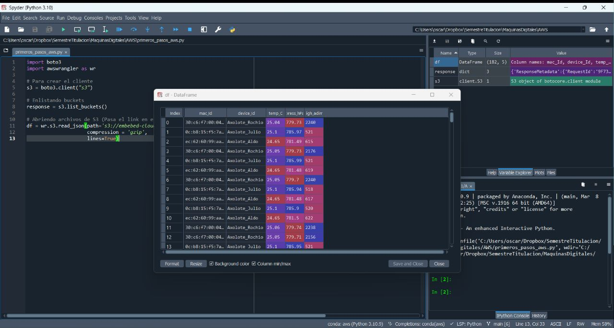
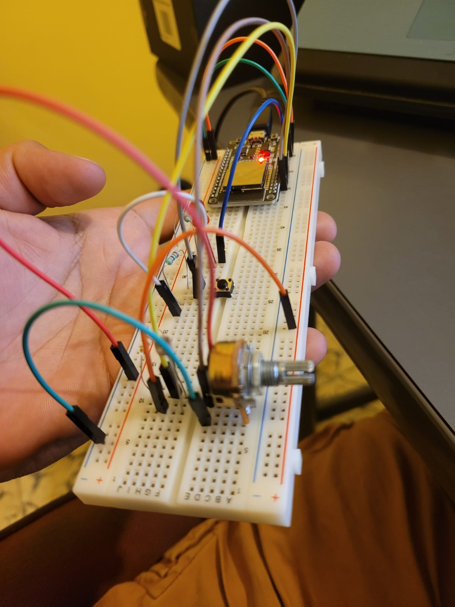
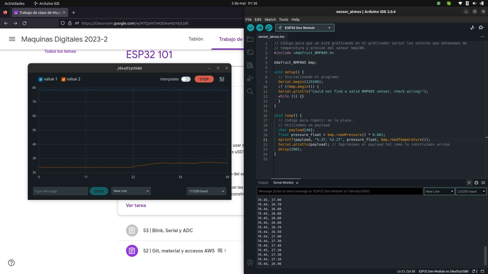
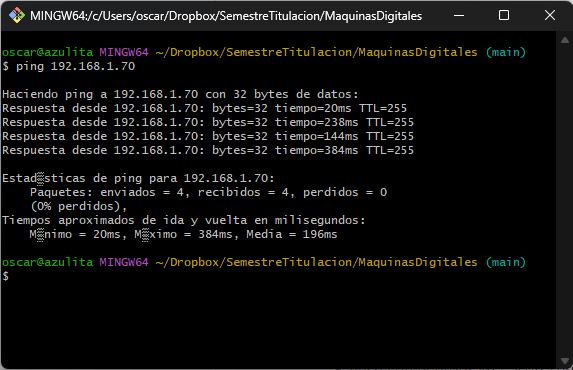
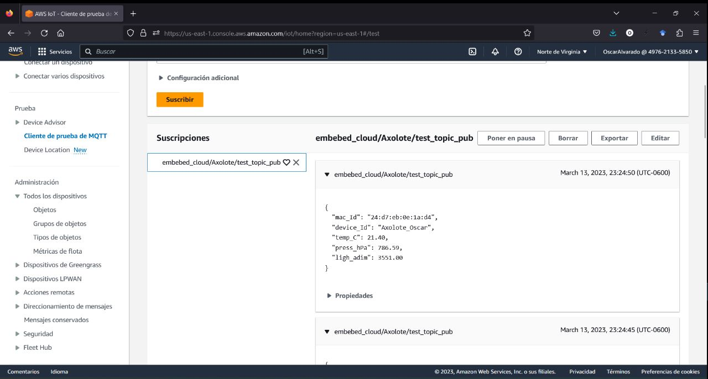
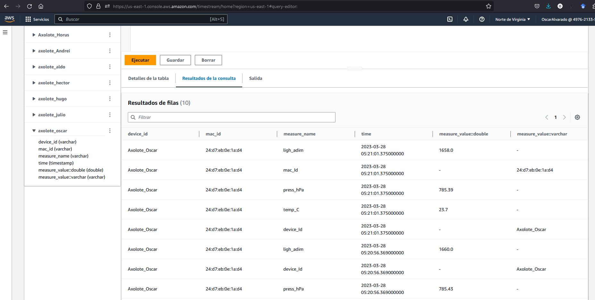
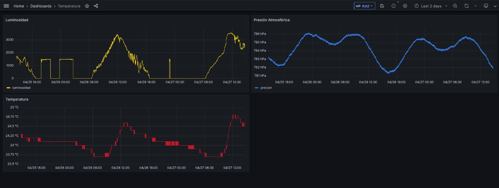
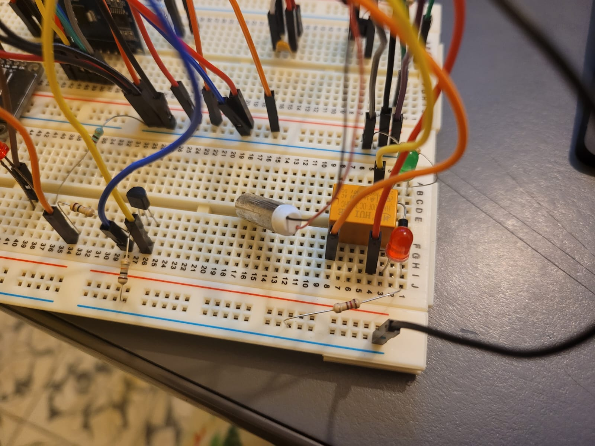
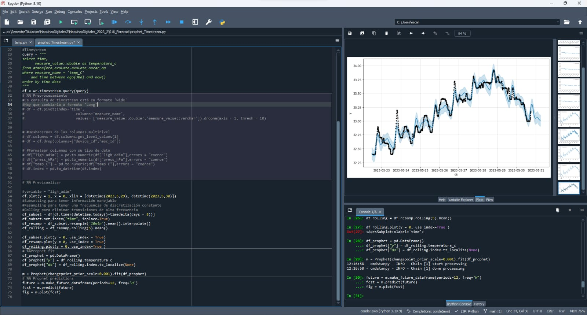

# Maquinas-Digitales

Repositorio donde se alojarán los ejercicios, tareas y proyectos de la clase de **Máquinas Digitales con Laboratorio** del Semestre 2023-2.
Se puede consultar la información del curso en la siguiente página:

https://web.fciencias.unam.mx/docencia/horarios/presentacion/342348

## Lo que hicimos durante el curso

- [AWS wrangler](https://github.com/OscarAlvaradoM/Maquinas-Digitales/tree/main/Tareas/TareaS2)

    > Highlights

    

    
    

- [Instrumentación básica con ESP32](https://github.com/OscarAlvaradoM/Maquinas-Digitales/tree/main/Tareas/TareaS3)

    > Highlights

    

    
    

- [Sensado de datos atmosféricos y almacenamiento de datos](https://github.com/OscarAlvaradoM/Maquinas-Digitales/tree/main/Tareas/TareaS4)

    > Highlights

    

    
    

- [Archivos JSON y conexiones inalámbricas con ESP32](https://github.com/OscarAlvaradoM/Maquinas-Digitales/tree/main/Tareas/TareaS5)

    > Highlights

    

    
    

- [Profundización en instrumentación y envío de datos a AWS](https://github.com/OscarAlvaradoM/Maquinas-Digitales/tree/main/Tareas/TareaS6)

    > Highlights

    

    
    

- [PWM, Timestream y Grafana](https://github.com/OscarAlvaradoM/Maquinas-Digitales/tree/main/Tareas/TareaS7)

    > Highlights

    

    
    

    

    
    

- [Motores y Relevadores](https://github.com/OscarAlvaradoM/Maquinas-Digitales/tree/main/Tareas/TareaS8)

    > Highlights

    

    
    

- [Forecasting con prophet](https://github.com/OscarAlvaradoM/Maquinas-Digitales/tree/main/Tareas/Forecasting)

    > Highlights

    

    
    

Cualquier duda o comentario no dudes en contactarme a OscarAlvarado@ciencias.unam.mx
