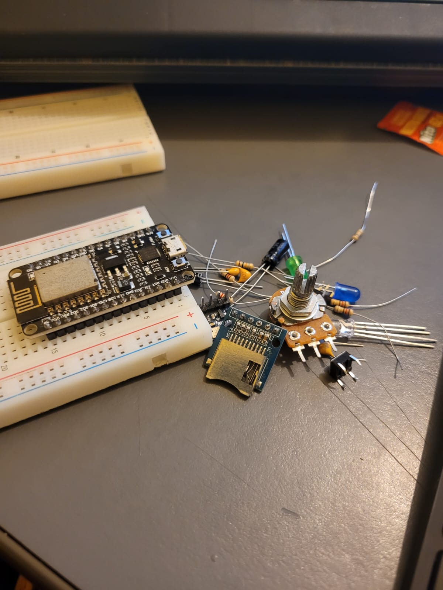
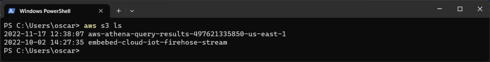
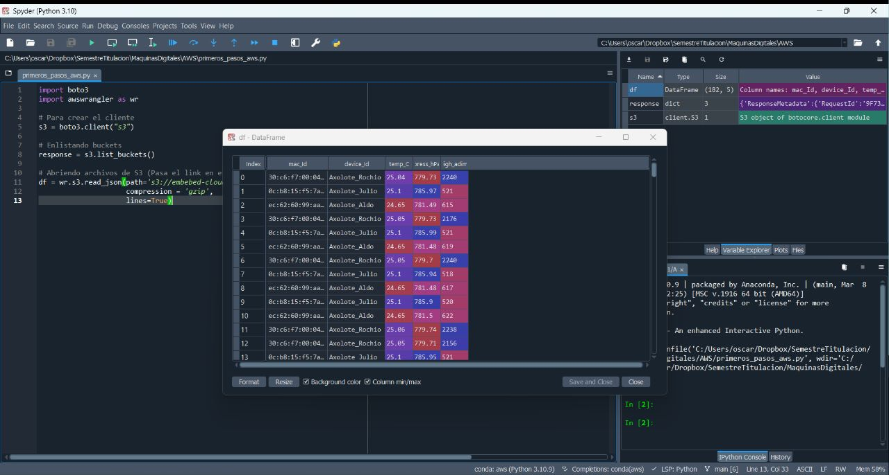

<h1 style="text-align: center;">Tarea 1</h1>
<h2 style="text-align: center;">Máquinas Digitales con Laboratorio</h2>
<h3 style="text-align: center;">Óscar Alvarado</h3>

* **Repositorio en Github, en donde subirás tu trabajo del semestre.**
El repositorio se encuentra en la siguiente [dirección](https://github.com/OscarAlvaradoM/Maquinas-Digitales).

* **Material de la primera entrega.**



* **AWS CLI con el resultado de enlistar los buckets de la cuenta. (```aws s3 ls```).**



* **Dataframe en Python de un archivo con datos muestra, que se encuentran en un bucket en formato .json.**


