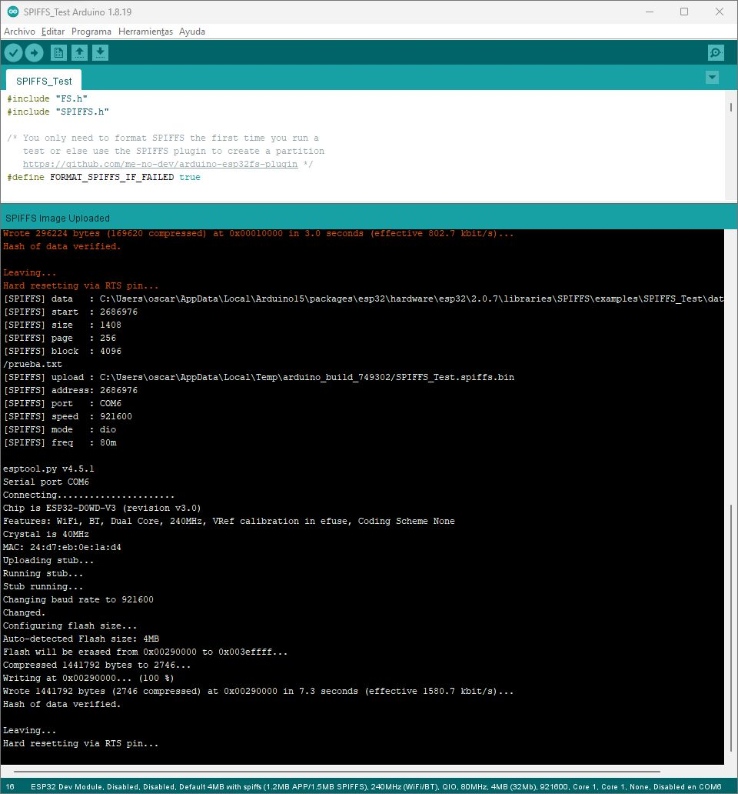
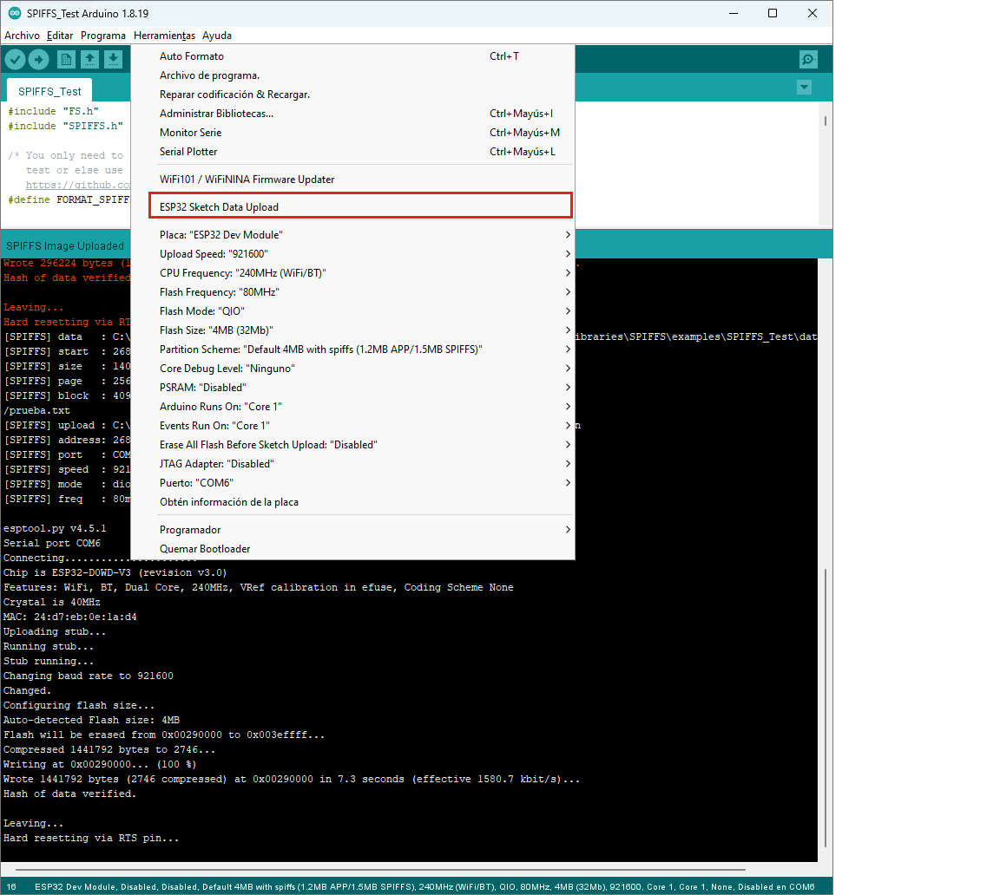

<h1 style="text-align: center;">Tarea 4</h1>
<h2 style="text-align: center;">Máquinas Digitales con Laboratorio</h2>
<h3 style="text-align: center;">Óscar Alvarado</h3>

**Json Parser y SPIFFS**

- Captura de la prueba exitosa del sistema de archivos SPIFFS.

- Responder: ¿Para qué queremos un sistema de archivos como SPIFFS? Da un ejemplo de uso.

Según entiendo, es como una API para poder subir archivos de manera fácil a la memoria de nuestro ESP32. Un ejemplo de uso sería poner archivos como de contraseñas, para que se manden datos a algún servidor sin tener que estar pasando siempre las contraseñas.

- Captura de la extensión "ESP32 Sketch Data upload" instalada en Arduino IDE V1

- Responder: ¿Por qué no podemos instalar Sketch Data Upload en Arduino IDE V2?

Según entiendo, no se ha actualizado a la V2 de Arduino IDE, ya que es la versión oficial de manera muy reciente.

- Captura de las lecturas de los sensores imprimiéndose en el monitor serie con formato json, usando el programa "json_serializer"

- Push con el programa "json_serializer", el cual serialice las lecturas de
los sensores en formato json y los imprima en el monitor serie.

**Módulo RF**

- Video en donde se vea que el celular envíe y reciba
caracteres desde y hacia el ESP, usando el programa de ejemplo de
Bluetooth que usamos en clase. Se tiene que ver simultáneamente el uso
de la app "Terminal Bluetooth" y el monitor serial de Arduino.
- Captura de pantalla de la recepción de lecturas de los sensores en la Terminal Bluetooth del celular.
- Captura de la conexión al WiFi local con ESP32. Debe mostrarse el SSID y la IP asignada al ESP.
- Captura de la prueba de Ping al ESP32 desde la terminal de la PC.
- Captura del archivo "Credentials.h".
- Responder: ¿Podemos usar simultáneamente WiFi y Bluetooth con ESP32?
- Responder: ¿Por qué creamos Credentials.h?
- Push con los programas "Bluetooth_logger" y "Conexion_WiFi". Advertencia: Si hay claves hardcodeadas, hay tabla.