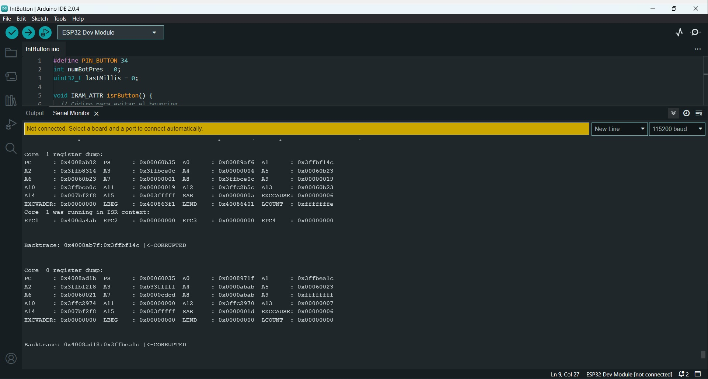
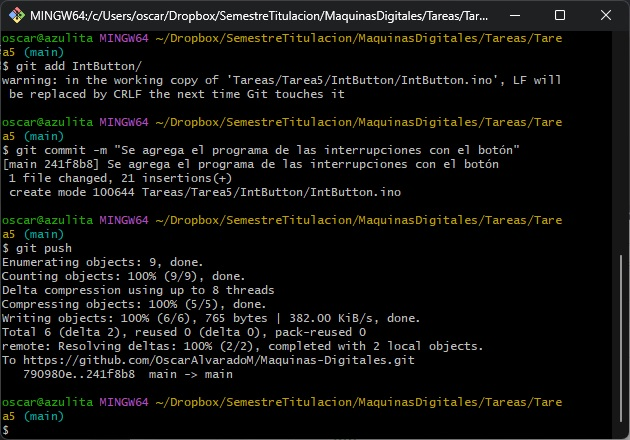
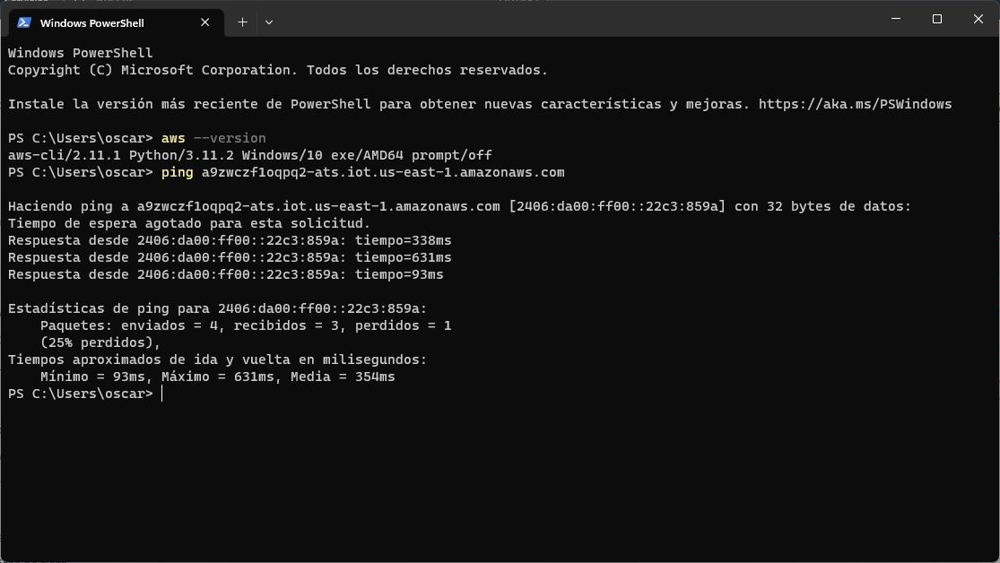
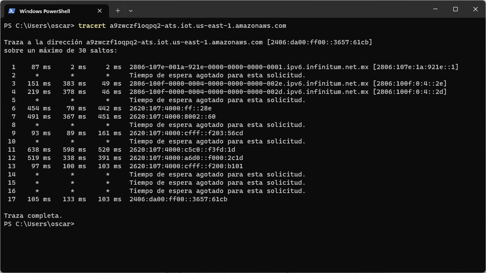
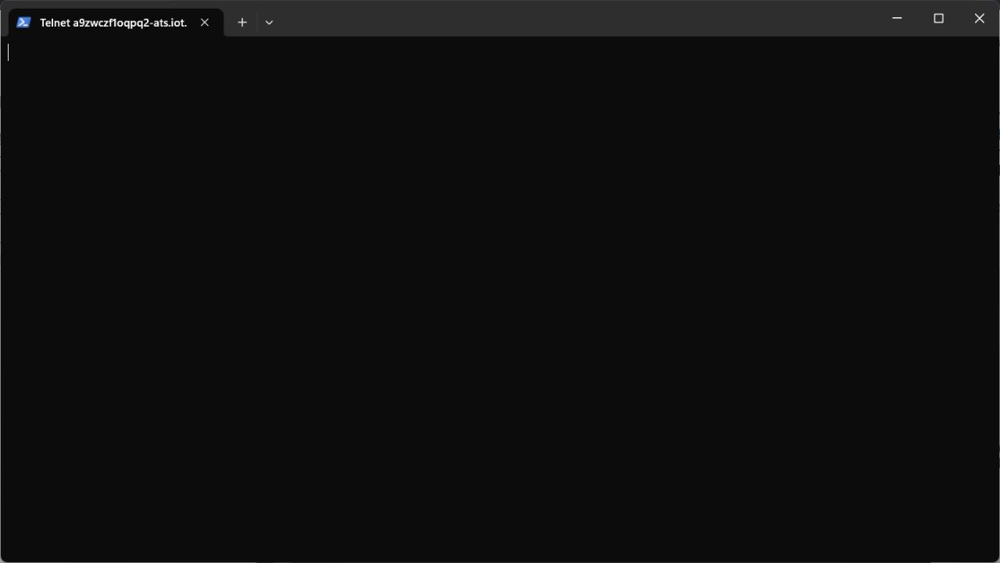
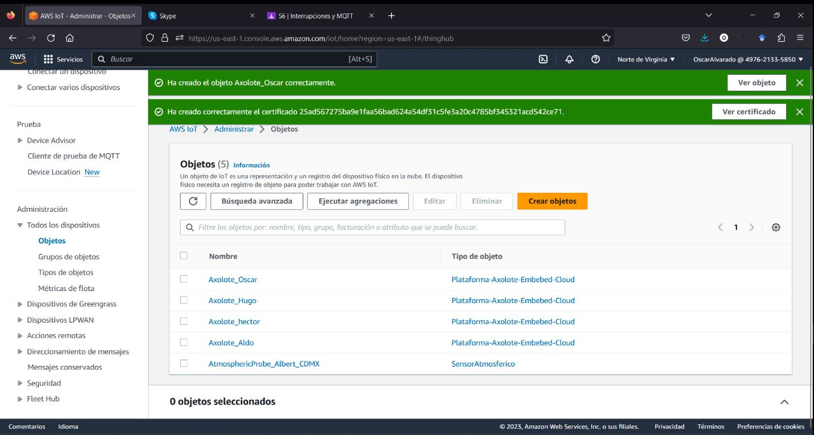
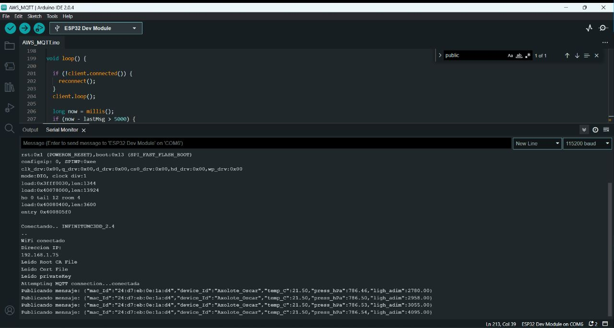
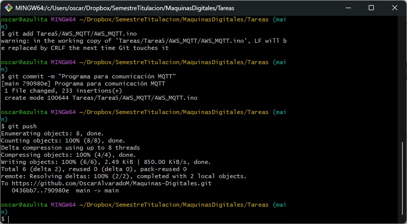

<div align="center"><h1 align="text-align: center;">Tarea 5</h1></div>
<div align="center"><h2 align="text-align: center;">Máquinas Digitales con Laboratorio</h2></div>
<div align="center"><h3 align="text-align: center;">Óscar Alvarado</h3></div>

**Interrupciones**

- Video del monitor serie mostrando el conteo de veces que se ha presionado el botón, usando el programa "IntButton". Se tiene que ver que se está presionando el botón.

    [](https://youtube.com/shorts/6N-LiJN4tRA)

- Responder: ¿Qué ventaja tienen las interrupciones contra el polling? ¿Por qué es más adecuado usarlas para leer un botón?

  >Con las interrupciones podemos meter órdenes y que el programa las detecte, evitando que se queden en el limbo esas órdenes. Es más adecuado porque estamos teniendo en cuenta las órdenes correctaemnte.

- Explicar qué es el rebote del botón (bouncig) y explicar sus técnicas de mitigación: Por software y por hardware.

  >Es una serie de perturbaciones de la señal que se crean al apretar el botón y al permanecer en encendido por completo. Por software se mitiga como lo hicimos en clase, esperando un tiempo (idealmente el tiempo de las perturbaciones) para que se reciba la siguiente orden de haber apretado el botón. Por hardware con un capacitor, que según Rodrigo dijo que podría funcionar como un filtro pasa altos, pero más bien yo creo que es por el direccionamiento del capacitor.


- (Opcional) Responder: ¿Cuál es la duración máxima default de una función que se invoca por interrupción en ESP32? ¿Se puede usar un Serial.println() dentro de un ISR?

  
  >Parece que no es posible, me sale este error que sale en la siguiente imagen:
  </span>
  <p align="center">
  
  </p>

- Push del programa "IntButton"

  <p align="center">
  
  </p>


**MQTT**

- Captura con las pruebas de alcance del endpoint del servidor MQTT (Broker MQTT) de Amazon. Las pruebas se hacen desde la terminal del sistema operativo (Explicar cuál es el propósito de cada una.): 
  - 1) ```ping```: 
      >Como lo vimos en clase, nos da una dirección IPv6 que está en virginia, pero básicamente sirve para ver si el dispositivo está conectado a una red.

    <p align="center"></p>

  - 2) ```traceroute```(Linux) o ```tracert```(Windows): 
      >Podemos ver los servidores intermedios que hay entre mi dispositivo y el que hay en virginia.

    <p align="center"></p>

  - 3) ```telnet```: 
      >Para enlace a un servidor tipo SSH, pero con encriptación de extremo a extremo 

    <p align="center"></p>


- Captura del objeto Axolote_{tu_nombre} en la consola de administración de IoT Core.

  <p align="center"></p>

- Captura de la terminal serie donde se muestre que el ESP envía lecturas al servidor MQTT.

  <p align="center"></p>

- Captura del cliente de prueba de IoT Core leyendo los mensajes que llegan al servidor MQTT.

  <p align="center"></p>

- Video que muestre que se envía un mensaje desde el cliente de prueba hacia el tópico al que está suscrito el ESP. En la terminal serial debe verse que el ESP recibe el mensaje y lo despliega.

  [](https://youtu.be/ln6iCiU7-dw)

- Push con el programa "aws_mqtt".

  <p align="center"></p>