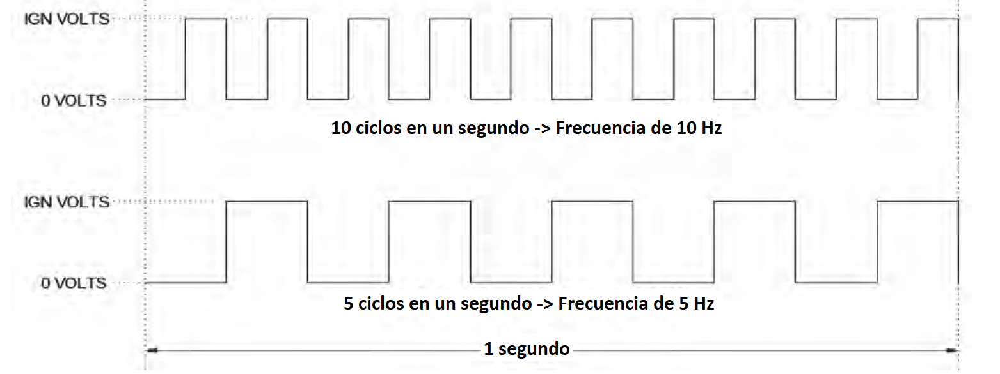
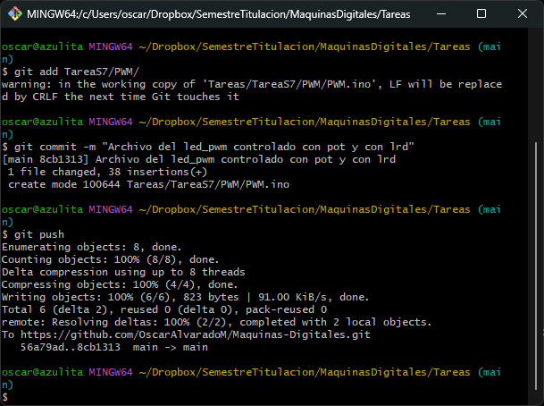
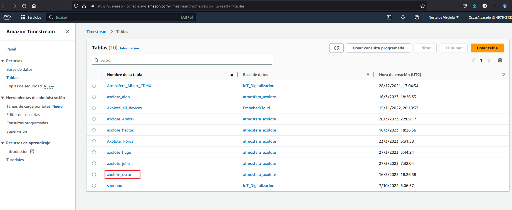
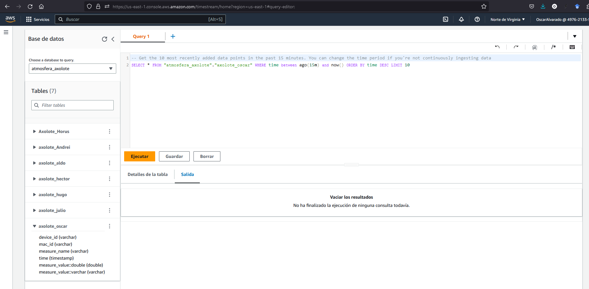
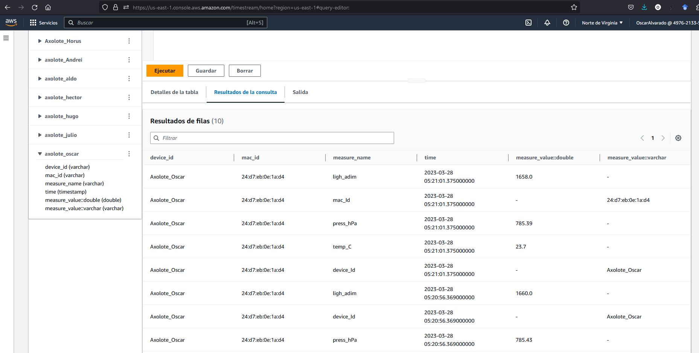
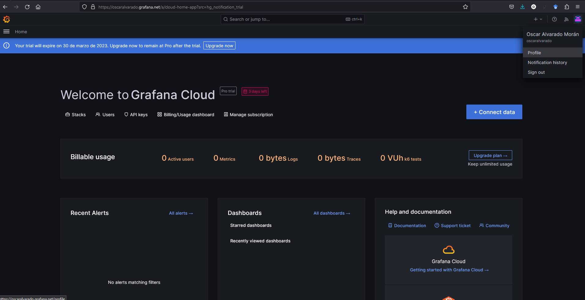

<h1 align="text-align: center;">Tarea S7</h1>

<h2 align="text-align: center;">Máquinas Digitales con Laboratorio</h2>

<h3 align="text-align: center;">Óscar Alvarado</h3>

**PWM**

- Video en el que se controle el brillo del LED con el potenciómetro.
  
    

- Video en el que se controle el brillo del LED con el fotoresistor.

    

- Emitir una señal PWM suena complejo. ¿Por qué simplemente no variamos el voltaje de entrada de un LED para controlar su brillo?

    > Los dispositivos digitales no pueden enviar más que dos tipos de señales, sólo el 0 o 1, por lo que PWM es una excelente alternativa para trabajar con lo que se tiene.

- Explicar los siguientes conceptos y señalarlos en un esquema: 
    - 1) Ciclo de trabajo 

    > Es el porcentaje de tiempo en un periodo en que la señal es emitida como 'ON' o encendido.

    

    
    

    - 2) Frecuencia de PWM.

    > Es el número de veces que se ccompleta un ciclo por segundo.

    

    
    

- Hace unas semanas utilizamos la función analogRead(), la cual convierte las señales analógicas en digitales. Responder: ¿Por qué analogWrite() no hace la operación inversa de analogRead() y en su lugar emite una señal PWM? ¿Cuál es la función opuesta a analogRead(), es decir, la que ocupa el DAC del microcontrolador para emitir señales analógicas? Apóyate en la documentación de Arduino y ESP32 Arduino core.

    > La función `analogWrite` no emite una señal PWM porque se usan puertos que no tienen chips DAC (Digital-to-Analogic Chip), caso contrario a que sí tienen ADC todos los puertos de lectura. La función `dacWrite` es la que sirve para usar con los puertos que tengan DAC.

- (Opcional) ¿Cuál es la frecuencia de la señal PWM que emite analogWrite()?¿Ves alguna potencial desventaja en que analogWrite() no tenga una opción para modificar la frecuencia de PWM o la resolución del ciclo de trabajo?

    > Parece que varía dependiendo de la tarjeta que estemos utilizando. Por ejemplo, en el Arduino UNO son 490 Hz. Creo que el problema con que no se puedan cambiar las frecuencias ni el ciclo de trabajo nos podría llevar a problemas tipo "aliazing" que parecería que escribiríamos un tipo de onda (con el tope de frecuencia) pero con otra onda en mente.

- Push con el programa "led_pwm"

    

    
    

**Timestream**

- Captura de la tabla "Axolote_{tu_nombre}" en Timestream.

    

    
    

- Captura de la regla de redireccionamiento  de mensajes MQTT "Axolote{tu_nombre}" en la consola de administración de AWS.

    

    
    

- Explicar la función de los elementos de las declaraciones SQL: 

  1) SELECT 

    > Para el tipo de operación que haremos, que en este caso será seleccionar un intervalo de datos de la tabla.

  2) FROM 
  
    > Es la indicación de la tabla de la cuál estaremos seleccionando los datos.
  
  3) WHERE

    > Para no borrar toda la base de datos jeje. Justo ponemos la condición de los datos que estaremos viendo, por ejemplo aquí será para seleccionar datos con tiempo no mayor a 15 minutos.

- ¿Qué función tiene el "Rol" que se asocia a la regla de redireccionamiento?

    > Jalar los datos del cliente a donde estamos enviando nuestros datos de la ESP32 y ponerlos en formato de tabla desde el JSON.

- Previsualización de los datos meteorológicos en tu tabla de Timestream.

    

    
    

- Explicar brevemente qué es Timestream y menciona dos características que la distingan de otras bases de datos. ¿Para qué otros aplicaciones se sugiere?

    > Es una base de datos con esteroides, creo que va más allá de un SQL(que según entiendo es SQL y No-SQL) en el sentido que se puede hacer un análisis rápido con series de tiempo de las consultas. Es escalable y _sin servidores_. Una sugerencia de aplicación es de monitoreo de aplicaciones! Como análisis de secuencia de clicks.

- Captura que pruebe que ya tienes una cuenta en Grafana.

    

    
    
