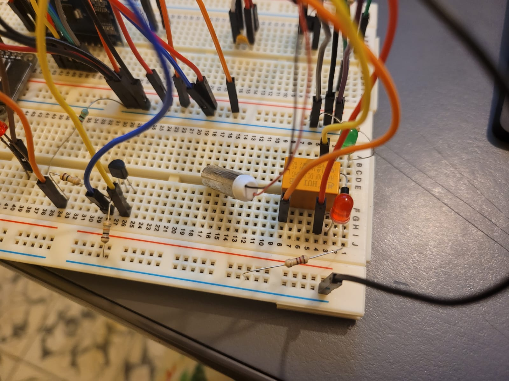
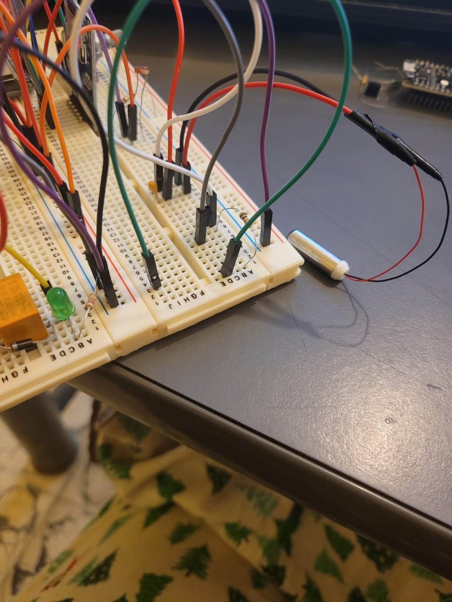
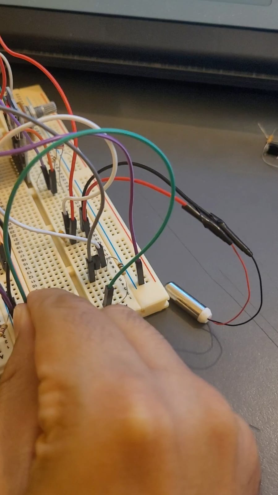
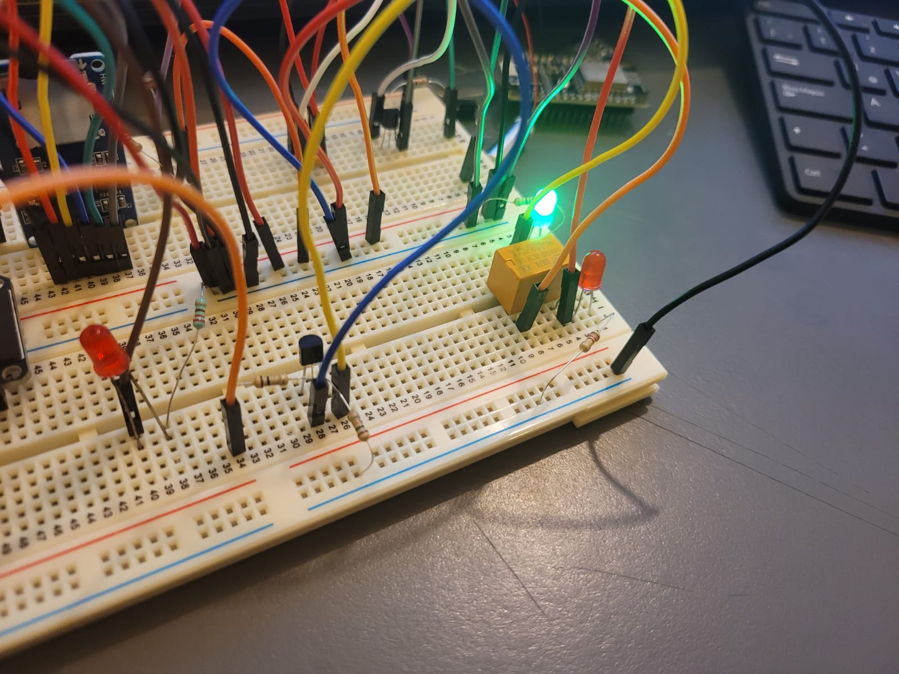
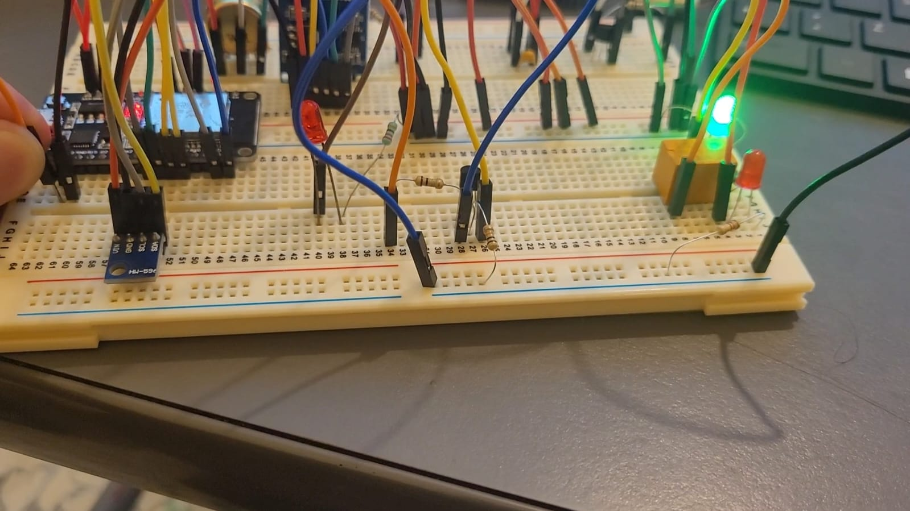

<h1 align="text-align: center;">Tarea S8</h1>

<h2 align="text-align: center;">Máquinas Digitales con Laboratorio</h2>

<h3 align="text-align: center;">Óscar Alvarado</h3>

*Material y circuitos*

- Foto de los componentes de la segunda entrega de material.

    

    
    

- Foto del circuito del motor vibrador.

    

    
    

- Video en donde se utilice un cable de control para encender y apagar el vibrador manualmente.

    

- Foto del circuito del relevador.

    

    
    

- Video en donde se utilice un cable de control para alternar entre los leds de colores conectados al relevador.

    